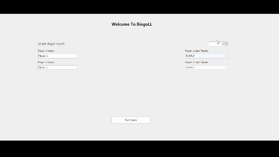
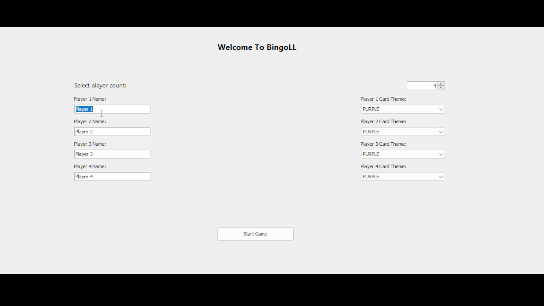
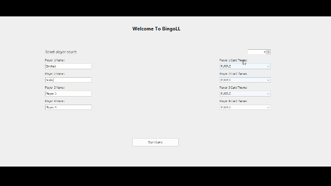
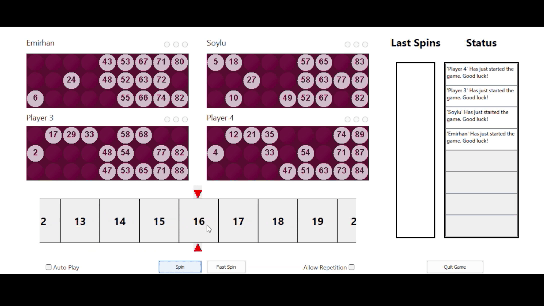
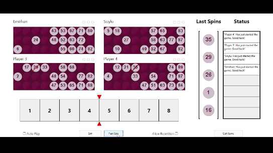
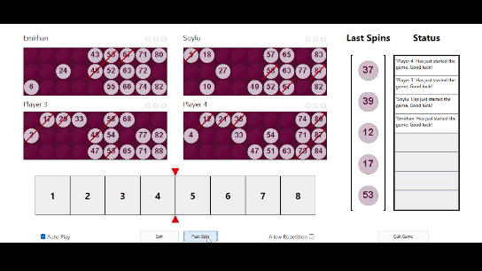
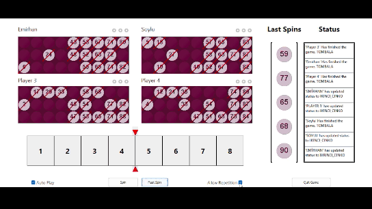

# BingoLL
 A Bingo Game Project with Multi-Linked Lists for Data Structures

## Features & Rules

### Add Players To the Game
You can set the player count [2-4]:

Also, you change players' names and card colours:

### Use a spinner to select random numbers

### Check Last Spins

### Select random numbers faster with the Fast Spin Button

### Mark the selected random number on the players' card

### Check the Auto Play box to mark numbers automatically

### Check the Cinko Status of the players from Radio Buttons

### Check the game Status updates from the Status Text Fields

### Check the Allow Repetition box to allow repetition while throwing random numbers

